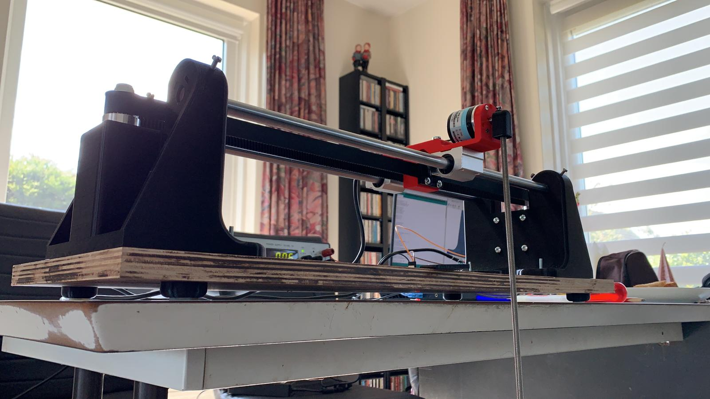
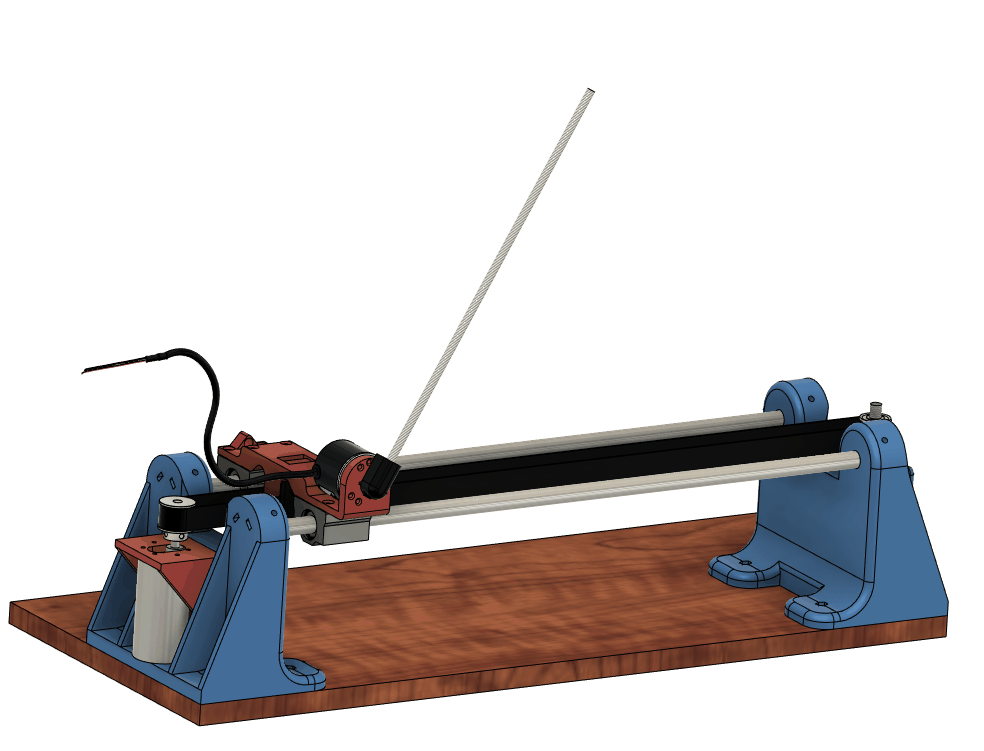

# Inverted Pendulum
Repo for different files regarding inverted pendulum project.

Eventual goal of this project is to train a Convolutional Neural Network (CNN), on simulated pendulum footage.

Then let the pendulum be stabilized by the CNN, as a proof that the setup is controllable and can work mechanically, I implemented LQR control first. 

Used quite some code from [this project](https://create.arduino.cc/projecthub/zjor/inverted-pendulum-on-a-cart-199d6f) , which was a huge help! 

Pictures of the first prototype below:

# Hardware (LQR control)

## Components:

* 2x Arduino Nano
* 1x Cytron 10Amp 5-30 V DC Motor Driver
* 1x Variable Power Supply
* 1x 600P / R-encoder
* 1x 12v 251 RPM DC Motor (43.8:1) (with encoder)
* 2x 500mm, 12mm diameter steel rods
* 2x SC12UU slider bearings
* 1x HTD 3M pulley (24 teeth, bore diameter 8)
* 1x HTD 3M pully (24 teeth, bore diameter 14)
* 1x 1000mm HTD 3M timing belt
* 1x 150mm M8 threaded rod
* 1x 400mm M6 threaded rod
* Some 3d printed parts(STL's included)
* MPU6050 (optional, not currently used)
* 20 mA LED, 270 Ohm resistor, switch button
* Bunch of M3, M4 and M5 nuts and bolts
* Wooden plank of 600mm by 250mm

## Animation of the CAD model:

# Software
The pendulum will try and swing up between hard set bounds (140mm on each side). When it enters a controllable region the LQR control takes over (click on link for video):

The 2 arduino nano's communicate over ISP, the main reason for using another Arduino is that we do not suffer resolution loss of the encoder of the motor and pendulum, because we can use both the A and B channels of the quadrature signal on interuptable pins (pins 2 and 3)

# TODO

- [x] Add feet with silicon strip to prevent sliding 
- [x] Add middle of rails indicator 
- [ ] Rearrange wiring
- [ ] Get small 12V (~200Watt) power supply
- [ ] Read out cart accelerations with MPU6050
- [ ] Migrate to NVIDIA Jetson Nano 
- [ ] Add double pendulum (need to find a way to neatly fix wiring for third encoder for this)
- [ ] Make the thing sort of portable

